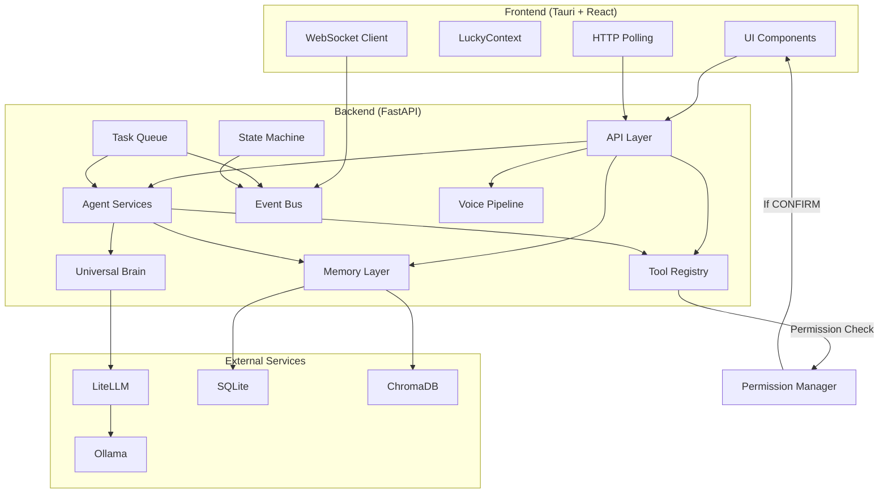
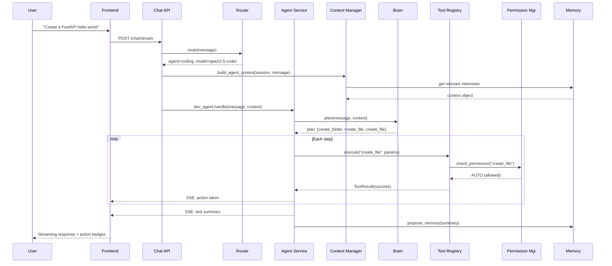
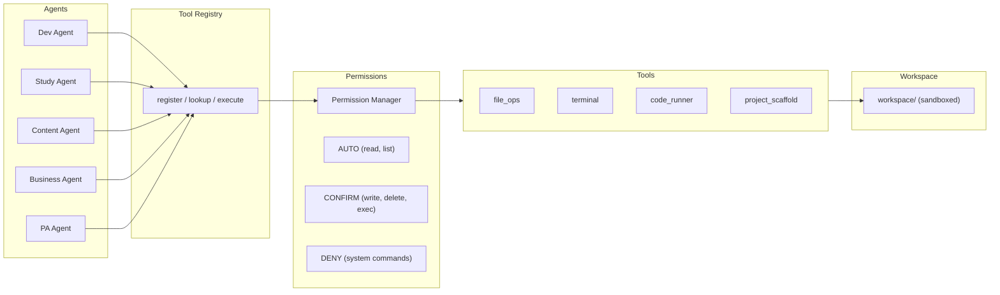
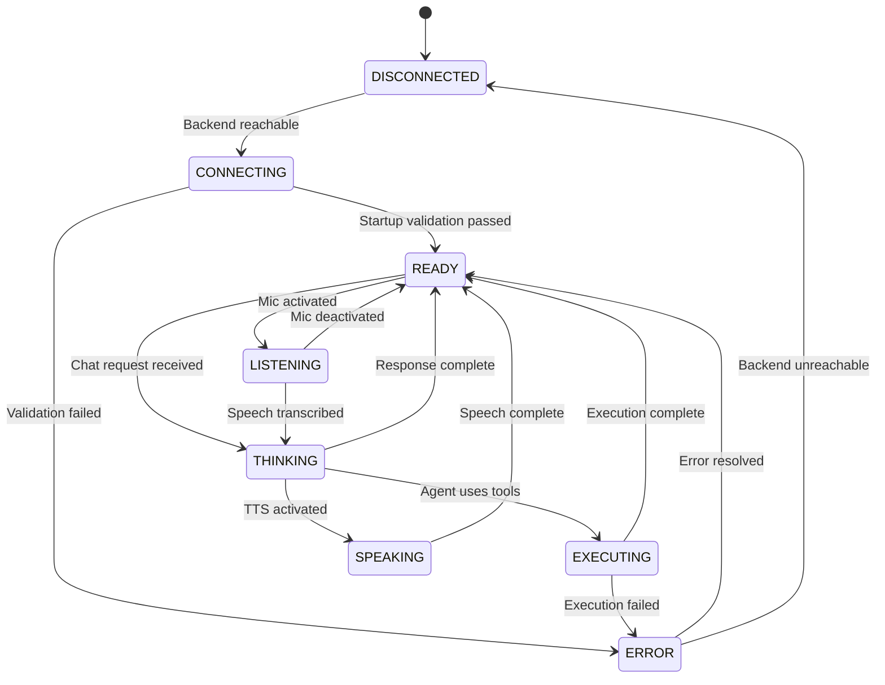

# LUCKY AI — Architectural Review & Improved Implementation Plan

---

## 1. Overall Architecture Score

**7.2 / 10** — Strong foundation, needs infrastructure before scaling.

| Dimension | Score | Notes |
|-----------|-------|-------|
| **Modularity** | 8/10 | Clean separation: brain, memory, API, config. The Universal Brain abstraction is excellent. |
| **Scalability** | 5/10 | No event bus, no task queue, no plugin hooks. Adding features will create coupling quickly. |
| **Safety** | 4/10 | No permission system. Execution layer planned without gate. One `rm -rf` from disaster. |
| **Extensibility** | 5/10 | No tool registry, no plugin architecture. Every new capability requires editing core files. |
| **Resilience** | 4/10 | No startup validation. No health checks beyond `/health`. No graceful degradation. |
| **State Management** | 5/10 | Frontend uses local `useState`. Backend has no application-level state machine. |
| **Observability** | 3/10 | Print statements only. No structured logging. No metrics. No audit trail for execution. |
| **Production Readiness** | 6/10 | CSS is broken. Deprecated API. Monolith frontend. Functional but fragile. |

---

## 2. Strengths (Preserve These)

These are architecturally sound. Do not touch them.

1. **Universal Brain Interface** — [universal_brain.py](file:///d:/lucky-ai/backend/brain/universal_brain.py) correctly abstracts all AI providers behind `think()` / `think_stream()` / `think_with()`. This is the project's most important architectural decision. Agents never know which model they're talking to.

2. **Config-driven provider switching** — [config.json](file:///d:/lucky-ai/config.json) + [config_loader.py](file:///d:/lucky-ai/backend/brain/config_loader.py) means zero code changes to switch from Ollama → OpenAI → Groq → Anthropic. The `_providers` registry in config is well-designed.

3. **Dual memory architecture** — SQLite for structured facts ([sqlite_db.py](file:///d:/lucky-ai/backend/memory/sqlite_db.py)) + ChromaDB for semantic recall ([vector_db.py](file:///d:/lucky-ai/backend/memory/vector_db.py)). Each handles what it's good at. The relevance-filtered `recall()` with distance thresholding (L2 < 1.25) is a smart detail that prevents hallucinated context.

4. **Memory approval flow** — `propose_memory()` → `approve_memory()` already exists. This respects the "never auto-save long-term memory" rule. The pattern just needs a proper Review Queue UI.

5. **Streaming architecture** — SSE streaming in [chat.py](file:///d:/lucky-ai/backend/api/chat.py) with metadata header → tokens → `[DONE]` sentinel. Frontend parsing in [App.tsx](file:///d:/lucky-ai/frontend/src/App.tsx) correctly handles this protocol including fallback to non-streaming.

6. **Agent-specific system prompts** — [prompt_builder.py](file:///d:/lucky-ai/backend/brain/prompt_builder.py) layers personality + memory + agent context cleanly. Each agent gets a distinct persona without duplicating base logic.

---

## 3. Weaknesses (Must Fix)

### 3.1 Architectural Weaknesses

**W1. Direct coupling between agents and execution** — The current plan has agents calling `file_ops.create_file()` directly. This creates a coupling explosion: every agent imports every tool. When you add a new tool, you touch every agent. When you add a permission check, you touch every call site.

**W2. No indirection between "what agents can do" and "how it's done"** — There is no concept of a Tool. Agents should declare *intent* ("I want to write a file"), not call *implementation* (`file_ops.create_file`). This is the single biggest architectural gap.

**W3. No permission boundary** — The execution layer (Phase 3) plans to expose `run_command(cmd)` and `delete_file(path)` via REST endpoints with no gating. A malicious prompt or routing error could execute destructive commands. The allowlist/blocklist in `terminal.py` helps, but permission must be a cross-cutting concern, not per-tool.

**W4. `sqlite_db.py` is becoming a god module** — It already has 264 lines handling personal info, projects, tasks, chat history, reminders, AND memory log. The plan adds `sessions` table AND `task_queue` table to this same file. By Phase 6, this single file will own 8+ tables and 40+ functions.

**W5. No application state machine** — The frontend has a `status` state (`"online" | "thinking" | "error"`), which is insufficient. There's no concept of system-wide state (disconnected, connecting, ready, listening, executing, etc.) shared between frontend and backend.

**W6. Observability gap** — The entire backend uses `print()` statements. No structured logging. No audit log for executed commands. No way to trace what happened when something goes wrong.

**W7. Memory written on every message** — In [chat.py L102-106](file:///d:/lucky-ai/backend/api/chat.py#L102-L106), `remember()` is called on every single exchange, storing a concatenation of question + answer in ChromaDB. This will fill semantic memory with noise. Trivial messages like "hey" or "thanks" get the same treatment as important facts. This contradicts the "never overwrite memory automatically" rule.

### 3.2 Existing Plan Weaknesses

**P1. Phase 2 introduces WebSocket too early** — The plan adds `/ws/metrics` for system monitoring in Phase 2, before tasks, voice, or notifications exist. At this stage, a simple polling endpoint (`GET /api/system/metrics` every 2-3 seconds) is simpler, more debuggable, and sufficient. WebSocket should arrive when multiple real-time channels justify the complexity.

**P2. Phase 3 and Phase 4 should not be separate** — Phase 3 builds the execution layer, Phase 4 builds agents that use it. But the execution layer has no consumers until Phase 4. These should be merged — build a tool, immediately wire an agent to use it, test end-to-end.

**P3. No startup validation** — The plan has no phase for verifying that Ollama is running, models are pulled, SQLite is accessible, ChromaDB is healthy, etc. The existing `start_lucky.bat` does some of this, but the backend itself boots blindly.

**P4. Frontend Phase 8 "Polish" is too vague** — "Micro-animations on every interactive element" and "premium typography" are not actionable. UI polish should be woven into every phase as components are built, not deferred to a cosmetic pass at the end.

---

## 4. Evaluation of Proposed Improvements

### Integrate Now (High Value, Low Complexity)

| # | Improvement | Verdict | When |
|---|-------------|---------|------|
| **1** | **Tool Registry** | ✅ **Critical.** This is the missing abstraction layer. Without it, adding any tool means editing agent code. | Phase 3 (foundation for all execution) |
| **2** | **Permission Manager** | ✅ **Critical for safety.** Must exist before execution layer ships. Even a simple `ask_user → allow/deny` flow. | Phase 3, alongside Tool Registry |
| **3** | **Startup Validator** | ✅ **Add immediately.** Cheap to build, prevents confusing runtime errors. Should run in Phase 1 with the lifespan fix. | Phase 1 |
| **8** | **System State Machine** | ✅ **High value.** Unifies frontend animations, orb behavior, and backend status into a single shared enum. Prevents the inevitable state-spaghetti. | Phase 2, alongside component extraction |
| **10** | **Live Metrics via Polling** | ✅ **Correct approach.** Start with polling. Upgrade to WebSocket in Phase 5 when task queue justifies it. | Phase 2 |

### Integrate Later (High Value, Wrong Timing Now)

| # | Improvement | Verdict | When |
|---|-------------|---------|------|
| **4** | **Event Bus** | ⏳ **Defer to Phase 5.** Before task queue exists, there are only 2 event flows (chat response → save to memory, memory proposed → show in UI). A bus is over-engineering at this scale. When tasks, notifications, background workers, and voice all exist, introduce it. | Phase 5 |
| **6** | **Review Queue** | ⏳ **The mechanism exists already** (`propose_memory` + `approve_memory`). What's missing is: (a) the chat endpoint should call `propose_memory()` instead of `remember()` directly, (b) a proper UI. Fix the bypass in Phase 1. Build the UI in Phase 6. | Phase 1 (fix) + Phase 6 (UI) |
| **7** | **Agent Context Manager** | ⏳ **Defer to Phase 4.** The current `build_memory_context()` + `build_semantic_context()` pattern works fine for today. When agents become stateful executors with multi-step plans, they'll need a richer context object. Build it then. | Phase 4 |
| **9** | **Plugin Architecture** | ⏳ **Scaffold only.** Create the `plugins/` directory and a `manifest.json` schema now. Don't build the loader, registry, or lifecycle. The Tool Registry from #1 naturally extends into plugins later — a plugin is just a folder of tools with a manifest. | Phase 3 (scaffold) |

### Defer Indefinitely (Low Priority or Risk of Over-Engineering)

| # | Improvement | Verdict | Why |
|---|-------------|---------|-----|
| **5** | **Workspace Manager** | ⏳ **Not yet.** Multiple isolated workspaces is a v2 concept. Right now, LUCKY needs *one* workspace that works safely. A configurable `WORKSPACE_ROOT` in config.json is sufficient. The abstraction can be added when users actually need to switch between Coding/Business/Content workspaces. | YAGNI until multi-project usage emerges |

---

## 5. Updated Implementation Roadmap

### Phase 1: Fix Foundation + Startup Validator

> Ship a bootable, styled, bug-free system. No new features — just make what exists actually work.

#### Backend

**[MODIFY]** [main.py](file:///d:/lucky-ai/backend/main.py)
- Replace deprecated `@app.on_event("startup")` with `lifespan` context manager
- Add `/api/system/status` (returns provider, model, uptime — a simple dict, no WebSocket)

**[NEW]** `backend/core/__init__.py`
- New `core/` package for cross-cutting infrastructure

**[NEW]** `backend/core/startup.py` — Startup Validator
- Verify on boot: config.json readable, SQLite writable, ChromaDB connectable, Ollama reachable (http ping to `/api/tags`), model exists in Ollama
- Return a structured `StartupReport` (list of checks, pass/fail, degraded mode flags)
- If Ollama is unreachable, start in degraded mode (accept chat requests but return a "backend unavailable" error) rather than crashing

**[NEW]** `backend/core/logger.py` — Structured Logging
- Replace all `print()` with Python `logging` using structured JSON format
- Log levels: DEBUG, INFO, WARNING, ERROR
- Single config point for log level (from `config.json`)
- This is 30 lines of code. Pays dividends in every subsequent phase.

**[FIX]** [chat.py](file:///d:/lucky-ai/backend/api/chat.py) — Memory Auto-Save Bypass
- Lines 102-106: `remember()` is called unconditionally on every message. This bypasses the approval flow. Change to `propose_memory()` so the user sees candidates in the Review Queue and approves what should persist long-term.
- Only store semantically dense exchanges, not greetings or one-word replies (simple heuristic: skip messages shorter than 40 characters)

#### Frontend

**[MODIFY]** [index.html](file:///d:/lucky-ai/frontend/index.html)
- Title → "Lucky AI"
- Add Inter font (Google Fonts link)

**[MODIFY]** [App.css](file:///d:/lucky-ai/frontend/src/App.css)
- Complete rewrite of the stylesheet. The current CSS has orphaned selectors from a prior design, and every class referenced by App.tsx is undefined. Write the correct stylesheet to match the existing JSX structure while preserving the cyberpunk/glass/HUD aesthetic intent.

**[MODIFY]** [tauri.conf.json](file:///d:/lucky-ai/frontend/src-tauri/tauri.conf.json)
- `productName` → "Lucky AI", window title → "Lucky AI", window size → 1400×900

**Exit Criteria:** Backend boots cleanly with startup report. Frontend renders all panels, messages, animations. No console errors. No visual regressions.

---

### Phase 2: Component Architecture + System Monitor + State Machine

> Break the frontend monolith. Add live system metrics. Introduce the state machine that drives UI behavior.

#### Backend

**[NEW]** `backend/api/system.py`
- `GET /api/system/metrics` — returns CPU, RAM, GPU (if NVIDIA), VRAM, disk usage via `psutil`
- `GET /api/system/status` — provider, model, uptime, active session count, system state
- **Polling, not WebSocket.** Frontend polls every 2-3 seconds. Simpler, more debuggable.

**[NEW]** `backend/core/state.py` — System State Machine
- Enum: `DISCONNECTED | CONNECTING | READY | THINKING | EXECUTING | SPEAKING | ERROR`
- Backend tracks its own state. Exposed via `/api/system/status`.
- State transitions are logged (audit trail).

**[MODIFY]** [requirements.txt](file:///d:/lucky-ai/requirements.txt)
- Add `psutil` (system metrics — pure Python, no GPU driver dependency)
- GPU/VRAM: try `pynvml` at runtime, gracefully degrade if no NVIDIA GPU

#### Frontend — Component Extraction

**[NEW]** `frontend/src/context/LuckyContext.tsx`
- Central state: active agent, session ID, system state, connection health, system metrics
- All child components consume this context instead of prop-drilling

**[NEW]** `frontend/src/hooks/useSystemMetrics.ts`
- Polls `GET /api/system/metrics` every 3 seconds
- Returns typed metrics object, handles errors gracefully

**[NEW]** `frontend/src/components/TopBar.tsx`
- Logo, status pill (driven by state machine), model indicator, clock

**[NEW]** `frontend/src/components/Sidebar.tsx`
- Agent list, system indicators, session list placeholder

**[NEW]** `frontend/src/components/ChatPanel.tsx`
- Message list, streaming logic, markdown rendering

**[NEW]** `frontend/src/components/InputDock.tsx`
- Input field, send button, keyboard handling

**[NEW]** `frontend/src/components/HudMetrics.tsx`
- Compact metrics panel: CPU, RAM, GPU, VRAM, model, agent, state
- Renders in the topbar or a collapsible right panel

**[MODIFY]** [App.tsx](file:///d:/lucky-ai/frontend/src/App.tsx)
- Refactor to compose extracted components wrapped in `LuckyContext.Provider`
- Each component gets its own CSS file co-located (e.g., `components/TopBar.css`)

**[NEW]** `frontend/src/types.ts`
- Shared TypeScript interfaces: `Message`, `Agent`, `SystemMetrics`, `SystemState`, `Session`

> [!TIP]
> **UI Polish Integration Rule** — From this phase onward, every component ships with its final visual design. No "make it look good later." Each `.tsx` file ships with a co-located `.css` file that implements the cyberpunk/glass/HUD aesthetic for that component. Phase 8 ("Premium UI Polish") becomes a refinement pass, not a rewrite.

**Exit Criteria:** Frontend is multi-component. System metrics appear live in the HUD. State machine drives the status pill. No more monolith App.tsx.

---

### Phase 3: Tool Registry + Permission Manager + Execution Layer

> This is the phase that makes LUCKY an OS. Build the infrastructure (registry, permissions) first, then build the tools on top.

#### Infrastructure

**[NEW]** `backend/tools/__init__.py`

**[NEW]** `backend/tools/registry.py` — Tool Registry
- `@tool(name, description, permission_level)` decorator to register a tool
- `ToolRegistry` singleton: `register()`, `get()`, `list_all()`, `execute(tool_name, params)`
- Every tool is a callable with a typed input schema (Pydantic model) and a typed result
- Agents never import tools directly. They call `registry.execute("create_file", {...})`
- This is the extension point for future plugins

**[NEW]** `backend/tools/permissions.py` — Permission Manager
- Permission levels: `AUTO` (always allow — read operations, listing), `CONFIRM` (ask user — write, delete, execute), `DENY` (blocked — format disk, system commands)
- Permission check runs inside `registry.execute()` — transparent to agents
- For `CONFIRM` level: returns a `pending_confirmation` response. Frontend shows approval UI. User clicks Allow/Deny. Backend continues or aborts.
- Permission decisions can be remembered per-tool (stored in SQLite: `permission_rules` table)

**[NEW]** `backend/tools/schemas.py`
- Pydantic models for tool inputs/outputs: `ToolResult`, `FileOpInput`, `CommandInput`, `CodeInput`

#### Execution Tools (registered via the registry)

**[NEW]** `backend/tools/file_ops.py`
- Tools: `create_file`, `read_file`, `edit_file`, `delete_file`, `create_folder`, `list_files`
- All paths resolved relative to `WORKSPACE_ROOT` from config — cannot escape sandbox
- Path traversal protection (reject `..`, symlink resolution)

**[NEW]** `backend/tools/terminal.py`
- Tools: `run_command`
- Subprocess execution with timeout, stdout/stderr capture
- Command allowlist from config. Anything not on the list → `CONFIRM` permission
- Structured output: `{command, exit_code, stdout, stderr, duration_ms}`

**[NEW]** `backend/tools/code_runner.py`
- Tools: `run_python`, `run_node`
- Writes code to a temp file inside workspace, executes in subprocess, captures output
- Timeout enforcement (default 30s)

**[NEW]** `backend/tools/project_scaffold.py`
- Tools: `scaffold_project`
- Templates: FastAPI app, React app, HTML site, Python script
- Creates full directory structure + starter files in workspace

**[NEW]** `backend/api/execution.py`
- REST endpoints for direct tool execution (testing, UI integration)
- `POST /api/tools/{tool_name}` — generic tool executor
- `GET /api/tools` — list all registered tools with descriptions
- `POST /api/permissions/respond/{request_id}` — approve/deny pending permission

**[MODIFY]** [config.json](file:///d:/lucky-ai/config.json)
- Add `execution` section: `workspace_root`, `allowed_commands`, `command_timeout`, `code_timeout`

**[NEW]** `plugins/` (scaffold only)
- `plugins/README.md` — documents the plugin contract: "a plugin is a folder containing a `manifest.json` and one or more Python files that register tools"
- No plugin loader yet. Just the contract definition and directory.

**Exit Criteria:** File ops, terminal, code runner all work via REST endpoints. Permission prompt appears for destructive operations. Tool registry lists all registered tools.

---

### Phase 4: Agent Services + Agent Context Manager

> Transform agents from prompt-switchers into task-executors that use tools.

#### Backend

**[NEW]** `backend/agents/__init__.py`

**[NEW]** `backend/agents/base_agent.py`
- `BaseAgent` abstract class:
  - `async plan(request, context) → ActionPlan` — ask the brain to plan steps
  - `async execute(plan) → AgentResult` — execute each step via Tool Registry
  - `async report(result) → str` — format result for the user
- Receives a `context: AgentContext` with: current workspace, active project, user prefs, relevant memories, conversation history
- Returns structured results: text response + list of actions taken + artifacts produced

**[NEW]** `backend/agents/context.py` — Agent Context Manager
- `AgentContext` dataclass: workspace path, active project, user preferences, relevant memories, coding style, conversation history
- `build_agent_context(session_id, message)` — assembles context from memory + config once per request
- Replaces the scattered `build_memory_context()` + `build_semantic_context()` calls that are duplicated in both chat endpoints

**[NEW]** `backend/agents/dev_agent.py`
- Extends `BaseAgent`. Uses tools: `create_file`, `edit_file`, `run_command`, `run_python`, `scaffold_project`
- Flow: analyze request → brain plans steps → execute via registry → test → report results
- Can create complete projects, not just text descriptions of projects

**[NEW]** `backend/agents/study_agent.py`
- Uses tools: `create_file` (save notes), brain for explanation
- Generates structured notes, saves to workspace, proposes to memory

**[NEW]** `backend/agents/content_agent.py`
- Uses tools: `create_file` (save drafts)
- Scripts, blog posts, SEO analysis → saves to workspace

**[NEW]** `backend/agents/business_agent.py`
- Uses tools: `create_file` (save proposals/emails)
- Proposals, cold emails, client analysis → saves to workspace

**[NEW]** `backend/agents/pa_agent.py`
- Uses tools: brain for analysis
- Reads from memory: active projects, overdue tasks, deadlines. Produces daily briefings.

**[MODIFY]** [chat.py](file:///d:/lucky-ai/backend/api/chat.py)
- When routing detects a specialized agent (not `brain`), delegate to the corresponding agent service
- Agent services return `AgentResult` which includes both text reply and structured actions
- Streaming still works — agent text output is streamed, actions are sent as structured SSE events

**[MODIFY]** [model_router.py](file:///d:/lucky-ai/backend/brain/model_router.py)
- Add `force_agent` parameter — let the user override routing by selecting an agent in the sidebar
- Currently the sidebar agent selection is purely cosmetic; it should actually force routing

**Exit Criteria:** "Create a Python FastAPI hello world project" → agent creates actual files in workspace. Actions visible in chat response. Dev agent can create, run, and test a project.

---

### Phase 5: Task Queue + Event Bus + WebSocket

> Now that agents execute real work, they need background execution, progress reporting, and real-time communication.

#### Backend

**[NEW]** `backend/tasks/__init__.py`

**[NEW]** `backend/tasks/queue.py`
- In-process async task queue using `asyncio.Queue` + worker coroutines
- Task states: `PENDING → RUNNING → COMPLETED | FAILED | CANCELLED`
- Task persistence in SQLite (`task_queue` table)
- Configurable worker pool size (default: 2 concurrent tasks)

**[NEW]** `backend/tasks/worker.py`
- Worker coroutines that pull tasks from the queue and execute agent services
- Progress reporting via the event bus
- Graceful cancellation support

**[NEW]** `backend/core/events.py` — Event Bus
- Simple in-process pub/sub: `emit(event_name, data)`, `on(event_name, handler)`
- Events: `task.started`, `task.progress`, `task.completed`, `task.failed`, `memory.proposed`, `permission.requested`, `system.state_changed`
- Handlers: notification dispatch, UI refresh triggers, memory updates, logging
- No external dependency. Just a dict of event name → list of async handlers.

**[NEW]** `backend/core/websocket.py` — WebSocket Manager
- Now WebSocket is justified: task progress, permission prompts, system state changes, and metrics all need real-time push
- Single `/ws` endpoint that multiplexes event types: `{type: "metrics", data: {...}}`, `{type: "task_progress", data: {...}}`, `{type: "permission_request", data: {...}}`
- Frontend connects once, receives all real-time events

**[MODIFY]** `backend/api/system.py`
- Add WebSocket endpoint. Metrics now pushed via WebSocket instead of polling.

**[NEW]** `backend/api/tasks.py`
- `POST /api/tasks` — submit a task (long-running agent work)
- `GET /api/tasks` — list all tasks with status
- `GET /api/tasks/{id}` — get task detail + result
- `POST /api/tasks/{id}/cancel` — cancel a running task

**[MODIFY]** [sqlite_db.py](file:///d:/lucky-ai/backend/memory/sqlite_db.py)
- Add `task_queue` table

#### Frontend

**[NEW]** `frontend/src/hooks/useWebSocket.ts`
- Connects to `/ws`, dispatches events to context
- Auto-reconnect with exponential backoff

**[NEW]** `frontend/src/components/TaskPanel.tsx`
- Active tasks with progress bars
- Task history (completed/failed)
- Cancel button

**[NEW]** `frontend/src/components/PermissionModal.tsx`
- When backend sends a `permission_request` event, show a modal: "Lucky wants to run `npm install`. Allow?"
- Options: Allow Once, Always Allow, Deny

**Exit Criteria:** Submit a long-running task → see progress in real-time → task completes → result appears in chat. Permission modal appears for destructive operations.

---

### Phase 6: Session Management + Memory Dashboard

#### Backend

**[NEW]** `backend/api/sessions.py`
- `GET /api/sessions` — list sessions with last message preview, sorted by recency
- `GET /api/sessions/{id}` — session detail
- `DELETE /api/sessions/{id}` — delete session and its chat history
- `PATCH /api/sessions/{id}` — rename session

**[MODIFY]** [sqlite_db.py](file:///d:/lucky-ai/backend/memory/sqlite_db.py)
- Add `sessions` table: id, title, created_at, updated_at, last_agent
- Auto-create session record on first message in a new session_id
- Auto-title sessions from the first user message (first 60 chars)

#### Frontend

**[NEW]** `frontend/src/components/SessionList.tsx`
- Sidebar section: past sessions, click to switch, delete, rename
- Active session highlighted

**[NEW]** `frontend/src/components/MemoryPanel.tsx`
- Tabbed view: Pending Approvals | Personal Info | Projects | Styles
- Approve/reject pending memory proposals with one click
- Search across all memory types
- Memory statistics (count, categories, last updated)

**Exit Criteria:** Sessions persist across restarts. User can switch between sessions. Memory approval flow works end-to-end via UI.

---

### Phase 7: Voice + AI Orb

#### Backend

**[NEW]** `backend/voice/__init__.py`
**[NEW]** `backend/voice/stt.py`
- Whisper integration: audio upload → text transcription
- `POST /api/voice/transcribe` (accepts WAV/WebM upload)
- Startup validator checks if Whisper model is available

**[NEW]** `backend/voice/tts.py`
- Piper TTS integration: text → audio stream
- `POST /api/voice/speak` (returns audio/wav stream)

**[MODIFY]** [requirements.txt](file:///d:/lucky-ai/requirements.txt)
- Uncomment voice dependencies: `openai-whisper`, `piper-tts`, `sounddevice`, `numpy`

**[MODIFY]** `backend/core/state.py`
- Add `LISTENING` and `SPEAKING` states to the state machine

#### Frontend

**[NEW]** `frontend/src/components/AiOrb.tsx`
- Central animated orb, driven entirely by the System State Machine:
  - `READY` → slow breathing pulse
  - `LISTENING` → expanding concentric rings
  - `THINKING` → spinning particles
  - `EXECUTING` → segmented progress ring
  - `SPEAKING` → waveform animation
  - `ERROR` → red pulse
- Click orb → toggle voice input (mic capture via Web Audio API)
- Orb color follows active agent color from context

**Exit Criteria:** Click orb → speak → text appears in input → Lucky responds → response spoken back → orb animates through each state.

---

### Phase 8: Refinement Pass

> Not a rewrite. A polish pass on everything shipped in Phases 1-7.

- Audit all animations: consistent easing, duration, no janky transitions
- Audit typography: Inter weight hierarchy (300/400/500/700), consistent sizes
- Audit color consistency: all agent colors, status colors, accent colors
- Performance audit: React re-render profiling, CSS animation GPU acceleration
- Accessibility basics: focus indicators, keyboard navigation, screen reader labels
- Ambient particle canvas background (low-density, 60fps, GPU-composited)
- Responsive adjustments for different desktop resolutions (1080p through 4K)
- Final visual comparison against JARVIS/HUD reference mood board

---

## 6. Revised Folder Structure

### Backend

```
backend/
├── __init__.py
├── main.py                      # FastAPI app + lifespan
├── core/                        # Cross-cutting infrastructure
│   ├── __init__.py
│   ├── startup.py               # Phase 1: Boot validation
│   ├── logger.py                # Phase 1: Structured logging
│   ├── state.py                 # Phase 2: System state machine
│   ├── events.py                # Phase 5: Event bus
│   └── websocket.py             # Phase 5: WebSocket manager
├── brain/                       # AI abstraction (EXISTING)
│   ├── config_loader.py
│   ├── universal_brain.py
│   ├── prompt_builder.py
│   └── model_router.py
├── memory/                      # Structured + semantic memory (EXISTING)
│   ├── sqlite_db.py
│   └── vector_db.py
├── tools/                       # Phase 3: Tool system
│   ├── __init__.py
│   ├── registry.py              # Tool registry + @tool decorator
│   ├── permissions.py           # Permission manager
│   ├── schemas.py               # Pydantic models for tool I/O
│   ├── file_ops.py              # File tools
│   ├── terminal.py              # Command execution tool
│   ├── code_runner.py           # Code execution tools
│   └── project_scaffold.py      # Project template tools
├── agents/                      # Phase 4: Agent services
│   ├── __init__.py
│   ├── base_agent.py
│   ├── context.py               # Agent context manager
│   ├── dev_agent.py
│   ├── study_agent.py
│   ├── content_agent.py
│   ├── business_agent.py
│   └── pa_agent.py
├── tasks/                       # Phase 5: Background execution
│   ├── __init__.py
│   ├── queue.py
│   └── worker.py
├── voice/                       # Phase 7: Voice pipeline
│   ├── __init__.py
│   ├── stt.py
│   └── tts.py
└── api/                         # HTTP endpoints (EXISTING + new)
    ├── chat.py
    ├── memory.py
    ├── system.py                # Phase 2
    ├── execution.py             # Phase 3
    ├── tasks.py                 # Phase 5
    └── sessions.py              # Phase 6
```

### Frontend

```
frontend/src/
├── main.tsx
├── App.tsx                      # Shell — composes components
├── App.css                      # Global styles + CSS variables
├── types.ts                     # Shared TypeScript types
├── context/
│   └── LuckyContext.tsx         # Central state provider
├── hooks/
│   ├── useSystemMetrics.ts      # Phase 2: Poll → Phase 5: WebSocket
│   ├── useWebSocket.ts          # Phase 5: Real-time events
│   └── useVoice.ts              # Phase 7: Mic capture
├── components/
│   ├── TopBar.tsx + TopBar.css
│   ├── Sidebar.tsx + Sidebar.css
│   ├── ChatPanel.tsx + ChatPanel.css
│   ├── InputDock.tsx + InputDock.css
│   ├── HudMetrics.tsx + HudMetrics.css
│   ├── SessionList.tsx + SessionList.css     # Phase 6
│   ├── MemoryPanel.tsx + MemoryPanel.css     # Phase 6
│   ├── TaskPanel.tsx + TaskPanel.css         # Phase 5
│   ├── PermissionModal.tsx                   # Phase 5
│   └── AiOrb.tsx + AiOrb.css               # Phase 7
└── assets/
```

### Root-level additions

```
lucky-ai/
├── workspace/                   # Phase 3: Sandboxed execution directory
├── logs/                        # Phase 1: Structured log output
├── plugins/                     # Phase 3: Plugin scaffold
│   └── README.md
└── (existing files unchanged)
```

### Directories NOT to add now

| Directory | Why Not |
|-----------|---------|
| `cache/` | No caching layer exists or is planned. YAGNI. |
| `security/` | Permissions live in `tools/permissions.py`. A whole directory is over-scoping. |
| `telemetry/` | LUCKY is privacy-first. No telemetry system. |
| `events/` | Event bus is one file (`core/events.py`). Doesn't need its own package. |

---

## 7. Architectural Diagrams

### System Overview



### Request Flow (Chat with Agent Execution)



### Agent ↔ Tool ↔ Execution Architecture



### System State Machine



---

## 8. Development Order

| Order | Phase | Dependencies | Duration Estimate |
|-------|-------|-------------|-------------------|
| **1** | Fix Foundation + Startup Validator | None | 1-2 sessions |
| **2** | Component Architecture + State Machine + Metrics | Phase 1 | 2-3 sessions |
| **3** | Tool Registry + Permissions + Execution Layer | Phase 1 | 2-3 sessions |
| **4** | Agent Services + Context Manager | Phases 2, 3 | 3-4 sessions |
| **5** | Task Queue + Event Bus + WebSocket | Phase 4 | 2-3 sessions |
| **6** | Sessions + Memory Dashboard | Phase 2 | 1-2 sessions |
| **7** | Voice + AI Orb | Phase 2, 5 | 2-3 sessions |
| **8** | Refinement Pass | All phases | 1-2 sessions |

> [!NOTE]
> **Phases 2 and 3 can run in parallel** — Phase 2 is frontend-heavy, Phase 3 is backend-heavy. No dependency between them until Phase 4 combines both.

> [!NOTE]
> **Phase 6 can run any time after Phase 2** — Session management and memory UI only depend on component architecture being in place. Can be pulled forward if needed.

---

## 9. Things to Postpone

| Item | Why | When |
|------|-----|------|
| **Multiple workspaces** | One safe workspace is the MVP. Multi-workspace adds workspace-switching UX, per-workspace configs, cross-workspace search. YAGNI until the first workspace is battle-tested. | v2 |
| **Plugin loader/lifecycle** | The Tool Registry *is* the plugin interface. A plugin is just tools + manifest. Build the loader when someone actually writes a plugin. | v2 |
| **Browser automation** | Requires Playwright/Puppeteer, a headless browser process, screenshot tools, DOM parsing. Heavy dependency. Not core to the AI OS vision. | v2 |
| **Mobile application** | Requires a mobile framework (React Native/Flutter), backend API hardening for remote access, authentication, HTTPS. Massive scope increase. | v3 |
| **Image/video generation** | Requires Stable Diffusion or API integrations. Separate model pipeline. Not core. | v3 |
| **WebSocket for metrics** | Polling is sufficient until Phase 5 introduces real-time needs. | Phase 5 |
| **GitHub/Docker/Notion integrations** | These are plugins. Build the plugin contract in Phase 3, implement actual plugins later. | v2+ |
| **Caching layer** | No identified performance bottleneck that caching would solve. LiteLLM doesn't cache, and that's fine for a local system. | If needed |

---

## 10. Final Recommendations

> [!IMPORTANT]
> **1. Build the Tool Registry before any execution code.** This is the single most impactful architectural improvement. Without it, every agent will directly import every tool, creating an unmaintainable coupling graph. With it, agents declare intent and the registry handles dispatch + permissions.

> [!IMPORTANT]
> **2. Fix the memory auto-save bypass immediately.** The current `chat.py` calls `remember()` directly on every exchange, bypassing the approval flow. This is not just a bug — it violates the project's core memory philosophy. Change to `propose_memory()` with a minimum-length filter in Phase 1.

> [!WARNING]
> **3. Do not split `sqlite_db.py` prematurely.** The plan to add sessions and task_queue tables to this file is concerning, but the alternative (5 separate DB files) is worse. Instead: keep one SQLite database, but organize functions into logical sections within the file. If it exceeds ~400 lines, extract into `memory/models/` sub-modules that share the same `get_conn()`. But don't do this preemptively.

> [!TIP]
> **4. Every component ships with final aesthetics.** The original plan deferred UI polish to Phase 8. This is how you end up with a working system that looks terrible and needs a visual rewrite. Instead: each component ships with its cyberpunk/glass/HUD styling from day one. Phase 8 becomes a *refinement* pass (animation timing, font weights, color tuning), not a design pass.

> [!TIP]
> **5. Structured logging from day one.** Replace `print()` with `logging` in Phase 1. This costs 30 lines of setup and pays dividends in every subsequent phase. When the execution layer runs user commands, you'll want an audit trail.

> [!NOTE]
> **6. The sidebar agent selection should actually work.** Currently, clicking an agent in the sidebar sets `activeAgent` state, but the chat endpoint ignores this — routing is always keyword-based. Add a `force_agent` field to `ChatRequest` in Phase 4 so the UI selection overrides the router.
